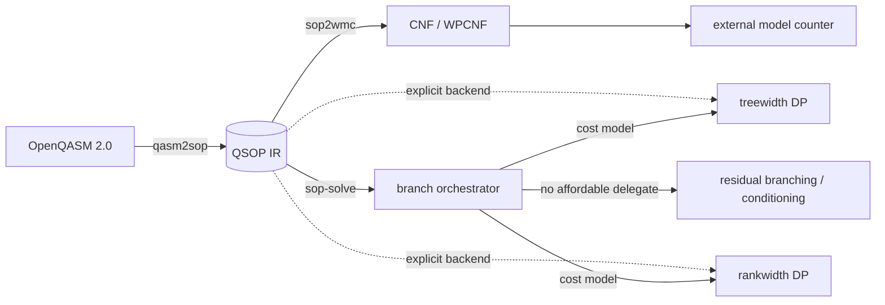

# dlx4sop

`dlx4sop` is a C/Meson toolkit for exact finite-modulus quadratic sums of
powers (QSOPs). The project goal is a competitive exact strong simulator using
QSOPs with fixed-boundary circuit amplitudes.

**Formal verification:** [`docs/lean`](docs/lean) contains a Lean 4 + Mathlib
formalization of the algorithms implemented here — correctness and
operation-count runtime of the rank-decomposition DP, its Fourier-mode and
linear-layout variants, and the coupling to real Clifford+T circuit
amplitudes. See [docs/lean/README.md](docs/lean/README.md) for the full
theorem-to-file map; that subdirectory is Apache-2.0 licensed (see
[docs/lean/LICENSE](docs/lean/LICENSE)).

**Benchmarks:** dlx4sop's branch/treewidth/rankwidth solver backends and
the `sop2wmc` + Ganak weighted-model-counting pipeline (all described below)
are ranked on the
public [qccq-gauntlet leaderboard](https://qccq-cgd.pages.dev/).



QSOP is the shared intermediate representation. The WMC export is a separate,
explicit path; inside `sop-solve`, the recommended branch backend selects
treewidth or rankwidth DP independently for each connected residual component.

## Tools

Prebuilt releases include the core command-line tools as `linux-x86_64` and
`macos-arm64` tarballs with SHA-256 sidecar files. The same tools are built
from source:

- `sop-check`: parse, validate, pin-reduce, and canonicalize QSOP files.
- `sop-stats`: print structural statistics, with opt-in exact small-width
  support-graph diagnostics.
- `sop-solve`: compute normalized amplitudes or exact residue-count histograms.
  Single-Fourier mode reports a certified floating-point error bound; stats mode
  can include the exact count vector and a convenience probability estimate via
  `--include-probability`.
- `qasm2sop`: import the supported OpenQASM 2.0 subset into QSOP,
  including common Clifford/T gates, supported phase rotations, `u/u2/u3`,
  controlled phase/H/SX gates, `dcx`, `rxx/ryy/rzz`, `ccz/ccx/rccx/cswap`,
  and `iswap`. Mid-circuit `measure` (with no classical feed-forward) and `reset`
  are lowered coherently — a measurement as the identity, a reset as a fresh `|0>`
  wire with the old value summed out. That equals a physical measure/reset exactly
  when the qubit is in a definite computational-basis state there (uncomputed or
  recycled ancillas, stabilizer syndromes — the alg85 regime, cross-checked against
  qiskit-aer); data-dependent `if` is still rejected.
- `sop2wmc`: export a QSOP to DIMACS CNF / WPCNF for external model counting.
  The CLI defaults to `--encoding auto`, which uses `peel1` preprocessing unless
  overridden and chooses between `amp-soft` and `amp-block` using structural
  coverage and estimated output size. Five concrete encodings are also available:
  - `residue-accumulator` (alias `residue`): one DIMACS CNF per
    residue 0..r−1; plain #SAT each. Works with any integer counter (Ganak
    `--mode 0`, d4, sharpSAT). Requires r calls per instance.
  - `amp-and` (alias `amplitude`): single WPCNF with hard Tseitin AND
    constraints and auxiliary weights ω^b. All auxiliaries are circuit-determined;
    use `ganak --mode 6 --verb 0`. Multiply the raw WMC result by the complex
    value in the `c amplitude_factor` metadata line to get the full amplitude.
  - `amp-soft`: single WPCNF with implication-only auxiliaries and soft weights
    ω^b − 1. Produces fewer clauses per edge than amp-and; Ganak integrates
    over underdetermined variables.
  - `residue-fourier`: r WPCNF blocks (one per Fourier exponent t) followed by
    an outer iDFT. Inner encoding selectable via
    `--wmc-fourier-inner (amp-and|amp-soft)`.
  - `amp-block`: single WPCNF; detects complete bipartite blocks of sign edges,
    computes the parity of each shore, and represents the block interaction with
    one soft weighted auxiliary. Uncovered edges use the `amp-soft` encoding.
    A block qualifies when its estimated savings are at least
    `--wmc-block-min-savings` and both shores have at least
    `--wmc-block-min-side` vertices (defaults 0 and 4).
- `scripts/build_external_qasm_manifest.py` / `scripts/bench_wmc_ganak.py`:
  shared OpenQASM-munging and Ganak-output-parsing helpers imported directly
  by the `.gauntlet/` adapters that back the qccq-gauntlet registration; not
  standalone CLIs.

## Solver Guide

- `sop-solve --backend branch --solve-mode auto`: recommended and the default
  for amplitude output. It prefers exact residue counting when practical, but
  may route directly to single-Fourier evaluation after width or count-vector
  preflight; safe count-mode refusals also fall back to single-Fourier.
- `sop-solve --backend treewidth --treewidth-order min-fill-max-degree`: direct
  DP baseline for developer and profiling runs.
- `sop-solve --backend rankwidth`: decomposition-DP backend with cut-rank
  diagnostics and count-table/Fourier modes; useful for comparison and targeted
  low-rank cases.

## QSOP Format

```text
p qsop-sign <r> <variables> <sign_edges>
n <normalization_h>
cst <constant_mod_r>
u <vertex> <unary_coefficient_mod_r>
e <u> <v>
f <vertex> <0 | 1>
```

Quadratic terms are sign edges with implicit coefficient `r/2`;
duplicate sign edges cancel by parity. Pins (`f`) are applied during parsing,
and canonical output uses dense variable IDs. Solver
`counts` are ordinary assignment counts bucketed by phase residue modulo `r`.

## Examples

```sh
build/sop-check tests/golden/sign_raw.qsop
build/sop-stats --format json tests/golden/sign_expected.qsop
build/sop-stats --exact-widths --exact-width-max-vars 12 tests/golden/solve_sign_path.qsop
build/sop-solve tests/golden/solve_disconnected.qsop
build/sop-solve --format residue-vector tests/golden/solve_disconnected.qsop
build/sop-solve --format stats --include-result tests/golden/solve_single.qsop
build/sop-solve --format stats --backend treewidth --solve-mode fourier tests/golden/solve_disconnected.qsop
build/qasm2sop --input 1 --output 1 tests/golden/qasm_h_boundary.qasm
build/qasm2sop --input 1 --output 1 tests/golden/qasm_h_boundary.qasm | build/sop-solve --format stats --include-probability -
build/sop2wmc --encoding auto --stats-only tests/golden/solve_disconnected.qsop
build/sop2wmc --residue all tests/golden/solve_disconnected.qsop
build/sop2wmc --residue 2 -o residue2.cnf tests/golden/solve_disconnected.qsop && ganak residue2.cnf
build/sop2wmc --encoding auto tests/golden/solve_disconnected.qsop | ganak --mode 6 --verb 0 -
```

### Approximate QASM imports

`qasm2sop` is exact by default: circuits with phases outside the supported
finite grid are rejected. Use `--approx X` to opt in to phase rounding, where
`X` is a positive additive amplitude error budget. Scientific notation is
accepted, for example:

```sh
build/qasm2sop --approx 1e-6 --input 0 --output 0 circuit.qasm
```

Approximate output includes comment lines recording the chosen modulus, rounded
phase count, and certified additive amplitude error bound.

### WMC result reconstruction

For residue encodings, combine the counter results as
`raw_amplitude = sum_k counts[k] * exp(2*pi*i*k/r)`. Amplitude encodings instead
produce a complex WMC that is multiplied by the emitted `amplitude_factor`.
In either case, `probability = |raw_amplitude|^2 * 2^(-norm_h)`, matching
`sop-solve --include-probability`. Metadata comments document the applicable
reconstruction and variable map.

## Build

```sh
meson setup build
meson compile -C build
meson test -C build --print-errorlogs
```

The default `build` directory is a debug build (`-O0`, assertions on), which is
appropriate for development and the test suite.

CI enforces at least 75% line coverage over production `src` files:

```sh
scripts/check-coverage.sh build-coverage
```

## Benchmarks

Comparative benchmarking can be found in
[qccq-gauntlet](https://qccq-cgd.pages.dev/), an external harness that runs
the dlx4sop backends and the `sop2wmc` + Ganak pipeline against shared
datasets/suites on a public leaderboard. `.gauntlet/adapter.py` and
`.gauntlet/adapter_wmc.py` are the two integration points gauntlet drives:
they import a circuit, run it through `qasm2sop`/`sop-solve` (or
`sop2wmc` + Ganak), and report back in the protocol gauntlet expects. Both
adapters import `build_external_qasm_manifest.py` / `bench_wmc_ganak.py`
from `scripts/` for OpenQASM munging and Ganak-output parsing.

## Solver internals

The branch backend delegates connected components to treewidth or rankwidth DP
according to a cost model. See [Solver internals](docs/solver-internals.md) for
the decision process, runtime tuning, calibration, and observability details;
`sop-solve --help-advanced` summarizes the main advanced flags.
