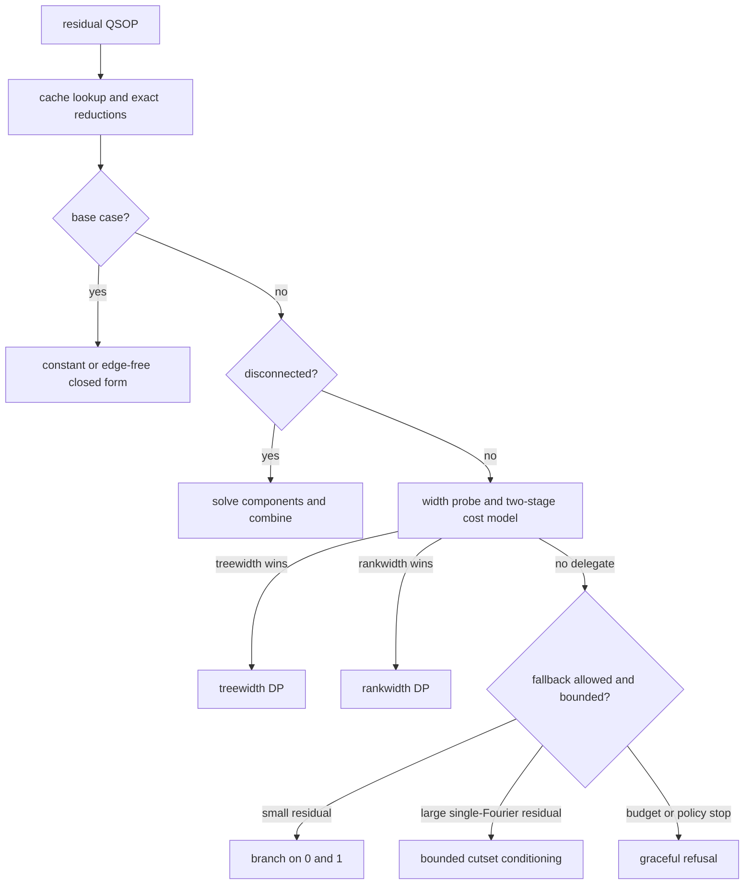
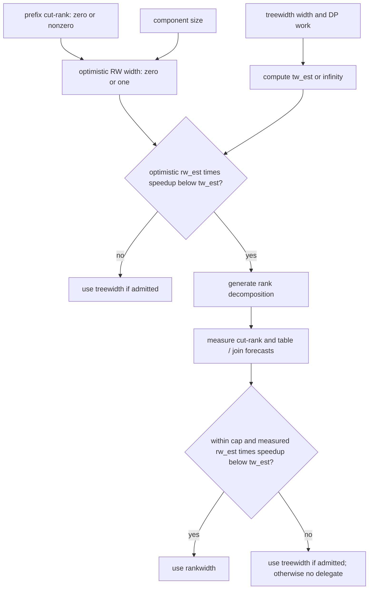

# Solver internals

This developer guide describes `sop-solve` dispatch, with emphasis on the
`branch` backend and its treewidth-versus-rankwidth cost model. See the
[README](../README.md) for installation, the QSOP format, and normal CLI usage.

## Architecture at a glance

The branch backend is an orchestrator, not a fourth dynamic-programming
algorithm. It simplifies and splits a residual QSOP, delegates affordable
connected components to a DP backend, and branches only when delegation is not
available.



The details differ between the two result shapes:

| Path | Result | Cost of the residue axis | Non-delegated component |
| --- | --- | --- | --- |
| count-table / all Fourier modes | exact count histogram | DP tables carry a factor of `r` | branch only while the component is within `--max-vars`; otherwise refuse |
| single-Fourier | one complex Fourier coefficient with a certified numeric error bound | no `r`-sized table | branch up to `--branch-single-max-fallback-vars`; above that, condition within the configured budgets or refuse |

`--solve-mode auto` is a CLI policy available with `--backend branch`. For
amplitude output it prefers exact counts when they are practical, but it can
start directly in single-Fourier mode after a width or count-vector preflight.
It also retries safe count-mode refusals in single-Fourier mode. Requesting
`--format residue-vector` disables auto dispatch and, with no explicit solve
mode, uses the exact count-table path.

### Ordered per-residual dispatch

For a connected residual, the effective order is:

1. Consult the residual cache. In single-Fourier mode, first run the enabled
   exact propagation/materialization steps, then cache the reduced residual.
2. Solve the constant and edge-free base cases in closed form.
3. Split disconnected support graphs, solve each component recursively, and
   convolve count histograms or multiply component amplitudes.
4. Probe decomposition widths and try DP delegation. Count mode skips this
   probe below 16 active variables; those small residuals go directly to the
   branch fallback.
5. If neither DP is selected, apply the mode-specific branch, conditioning, or
   refusal rule from the table above.

There are two whole-instance shortcuts. Count-table/all-modes solving can send
a connected root directly to treewidth before entering residual recursion.
`auto` can likewise send an obviously cheap single-Fourier root directly to
treewidth. Both shortcuts use the same pre-probe rankwidth comparison, so a
potentially profitable rankwidth case still enters the branch orchestrator.

## Delegation admission

The following are branch-backend limits, not limits of an explicitly selected
standalone backend:

| Delegate | count-table / all-modes branch path | single-Fourier branch path |
| --- | --- | --- |
| treewidth | min-fill width at most 14; a connected root with at most 2500 variables has a width-18 fast path | min-fill width at most 26, min-fill DP work at most `4.0e9`, and forecast peak memory at most 12 GiB |
| rankwidth | generated cut-rank at most 12 | generated cut-rank at most 12 |

The single-Fourier CLI `auto` fast path is slightly more conservative than the
branch delegate: it admits a direct treewidth root through width 25. Wider cases
enter the branch path, whose delegate ceiling is 26.

Treewidth width follows the elimination-order convention. A width-`w` factor
can contain `w + 1` variables and therefore `2^(w+1)` assignments. The
single-Fourier admission forecast is nevertheless written as
`2^w * 128 bytes`: 128 bytes is a calibrated peak-per-width-state factor that
includes live join intermediates; it is not the element size of one final
table. A measured width-26 case peaks near 7.5 GiB, while the forecast is 8 GiB
and remains below the default 12 GiB budget. An over-budget component is
reported as a delegate miss instead of being allowed to fail an allocation
inside the DP.

`--max-vars` is a separate sanity and exhaustive-search bound. It is not a
width bound: a very large low-width component can be cheap for DP. The CLI
defaults to 24 for the exact count path and raises an unset value to `2^24` for
single-Fourier/auto; the per-component width, work, and memory checks still
decide whether delegation is affordable.

## Treewidth-versus-rankwidth cost model

The cost model is enabled unless `--branch-rw-source none` is used. It answers
two questions: whether generating a rank decomposition is worth its own cost,
and, after generation, whether the measured rankwidth forecast beats
treewidth.



Define:

- `W_tw` as the effective treewidth work: min-fill
  `sum 2^(bag size)` over elimination steps, multiplied by `r` for
  count-table/all-modes decisions and left unchanged for single-Fourier.
- `T_rw`, `J_rw`, and `S_rw` as the rankwidth table, join-pair, and signature
  forecasts. Count tables include their residue axis in `T_rw`.
- `P_rw = C_rw_probe * nvars^2 * ceil(nvars / 64)` as the estimated cost of
  generating a decomposition and measuring its cuts.

The estimates are:

```text
tw_est = tw_fixed_overhead_ns + C_tw_table * W_tw

rw_est = rw_fixed_overhead_ns + rw_memory_penalty_ns
       + C_rw_table * T_rw
       + C_rw_join  * J_rw
       + C_rw_sig   * S_rw
       + P_rw

rankwidth wins  iff  rw_est * rw_min_speedup < tw_est
```

An inadmissible backend has an infinite estimate. Before the rankwidth probe,
`P_rw` is included, the join forecast is zero, and the best feasible generated
cut-rank is assumed: zero only when the natural-order prefix cut-rank is zero,
otherwise one. After generation, the real forecasts replace those optimistic
values and `P_rw` is sunk, so it becomes zero in the second comparison.

Natural-order prefix cut-rank is deliberately not used as an estimate or lower
bound for generated rankwidth. A different order can compress a high prefix
rank dramatically. Its safe pre-generation use here is only the zero/nonzero
distinction.

This two-stage policy prevents a decomposition probe from dominating a cheap
treewidth solve. The probe performs cut-rank work at roughly `2*nvars`
decomposition nodes and scales as `O(nvars^2 * words)` bit operations.

### Default coefficients

| Parameter | Default |
| --- | ---: |
| `tw_fixed_overhead_ns` | 10000 |
| `rw_fixed_overhead_ns` | 20000 |
| `C_tw_table` | 4 |
| `C_rw_table` | 80 |
| `C_rw_join` | 40 |
| `C_rw_sig` | 2000 |
| `C_rw_probe` | 2 |
| `rw_min_speedup` | 1.1 |
| `rw_memory_penalty_ns` | 0 |

The fixed overheads, speedup threshold, and memory penalty have
`--branch-tw-*` / `--branch-rw-*` flags. The five `C_*` coefficients have no
CLI flags; their defaults are the `BRANCH_POLICY_DEFAULT_C_*` constants in
[`src/solve/branch.c`](../src/solve/branch.c).

### Rank-decomposition source

The `sop-solve` CLI defaults to `--branch-rw-source auto`; the zero-initialized
library API defaults to `none`.

- `none` disables rankwidth probing.
- `auto` and `from-treewidth` derive a rank decomposition from the treewidth
  elimination tree.
- `native` uses the native `min-fill-cut` generator.
- `both` also tries the native generator and keeps the better forecast in the
  count-table path. The single-Fourier branch delegate currently treats `both`
  like `from-treewidth`.

### Treewidth estimate versus solve order

The cheap pre-probe statistics use plain min-fill. A selected treewidth solve
resolves a `min-fill-max-degree` order lazily, and tie-breaking can produce a
different width on components larger than 63 variables. Single-Fourier
rechecks the resolved width and memory forecast. If that order is no longer
admissible but an already-generated rank decomposition is within its cap, it
uses rankwidth rather than refusing immediately. The DP-work budget is still
based on the original plain-min-fill estimate; it is not recomputed for the
resolved order.

## Single-Fourier fallback and conditioning

Single-Fourier mode avoids `O(r)` count vectors by evaluating one Fourier mode
numerically. Before expensive work, odd target modes use an exact propagation
rule that sums out active degree-0/1 variables with unary coefficient `0` or
`r/2`. Propagation can cascade, unlock a delegate, or prove the subtree exactly
zero. It is disabled automatically for even `--fourier-target-mode`, where the
Hadamard identity used by the rule does not apply.

If a connected component has no delegate:

- `--branch-single-fourier-fallback delegate-only` refuses immediately.
- Otherwise, a component through `--branch-single-max-fallback-vars` (default
  64) uses ordinary cached residual branching.
- A larger component enters bounded cutset conditioning when
  `--branch-single-cutset-depth` is nonzero; otherwise it refuses.

The CLI enables conditioning with depth 16 and allows 30 consecutive stagnant
levels. The zero-initialized library API leaves conditioning off and normalizes
an unset stagnant-level limit to 1. Both interfaces default materialized
reduction to off.

At each conditioning node the solver shortlists variables, evaluates both real
children, and chooses the candidate with the best lexicographic score: most
exact-zero children, then smallest worst-child largest component, active
variable count, and active edge count, followed by extra-reduction and
variable-ID tiebreakers. Each lookahead applies enabled single-Fourier
propagation. The optional materialized `[HH]` simplifier is also applied when
`--branch-single-materialized-reduction` is enabled.
Delegation is re-probed as the residual shrinks; leaves that enter a DP remain
subject to the same width, work, and memory admission checks.

Conditioning is mainly useful for reducing treewidth until the wider
single-Fourier treewidth delegate becomes reachable. It does not reserve the
result for treewidth: rankwidth still participates whenever the pre-probe cost
test says its decomposition is worth generating.

### Candidate shortlists and the shadow graph

The default shortlist ranks variables by Hadamard-unlock counts, then degree.
An unlock count identifies a neighbor that is one pin away from becoming
eligible for an exact `[HH]` materialized reduction (`unlock3` / `unlock4` in
the implementation).

`--branch-shadow off|auto|on` controls an optional structural fallback; the CLI
default is `off`. It is considered only when the Hadamard-unlock shortlist has
no signal. The shadow graph drops coefficients, exhaustively removes
degree-0/1 vertices, and series-reduces degree-2 vertices with a fill edge. It
then ranks surviving vertices by remove-and-re-reduce lookahead. The shadow
result only changes which real variables receive the expensive child
evaluation; it is never solved or passed to a DP. In `auto` mode it is further
gated to residuals with at least 128 active variables and at least twice as many
active edges as variables.

The main conditioning defaults are:

| Option | CLI default |
| --- | ---: |
| `--branch-single-cutset-depth` | 16 |
| `--branch-single-lookahead-candidates` | 8 |
| `--branch-single-max-conditioning-nodes` | 4096 |
| `--branch-single-delegate-reprobe-interval` | 2 |
| `--branch-single-max-stagnant-levels` | 30 |
| `--branch-single-max-search-nodes` | 10000000 |
| `--branch-single-cache-budget-mib` | 256 |
| `--branch-single-cache-min-vars` | 12 |

A component that cannot reach a delegate within the depth, node, search, or
stagnation budgets refuses cleanly rather than continuing an unbounded
exponential recursion.

## Runtime controls

`sop-solve --help-advanced` summarizes the main switches. The controls most
closely tied to the dispatch described above are:

- Backend and mode: `--backend`, `--solve-mode`, `--max-vars`,
  `--treewidth-order`, `--fourier-target-mode`.
- Cost policy: `--branch-rw-source`, `--branch-rw-min-speedup`,
  `--branch-rw-fixed-overhead-ns`, `--branch-tw-fixed-overhead-ns`,
  `--branch-rw-memory-penalty-ns`.
- Single-Fourier admission: `--branch-single-delegate-max-width` (26),
  `--branch-single-delegate-max-dp-work` (`4.0e9`),
  `--branch-single-delegate-max-memory-mib` (12288), and
  `--branch-single-cutset-delegate-max-dp-work` (0, reuse the root budget).
- Single-Fourier search: `--branch-single-fourier-fallback`,
  `--branch-single-propagate`, `--branch-single-materialized-reduction`, the
  conditioning options above, and `--branch-shadow`.
- Rankwidth standalone policy: `--rankwidth-memory-budget-mib`,
  `--rankwidth-memory-policy`, `--rankwidth-join-strategy`,
  `--rankwidth-single-kernel`, and `--rankwidth-fourier-kernel`.

The process reads no solver-tuning environment variables.

## Calibrating the cost model

The CLI rejects calibration with single-Fourier. Use the branch count-table path
and provide a JSONL sink so both backend timings are comparable:

```sh
build/sop-solve --backend branch --solve-mode count-table \
  --branch-calibrate-backends --stats-jsonl calib.jsonl instance.qsop
```

Calibration bypasses the cost inequality so competing backends can be timed.
It never adopts a backend outside its normal delegate cap, although timing-only
rankwidth solves may run through the separate calibration ceiling of cut-rank
20. Per-decision JSONL records contain the predicted `treewidth_forecast_*` and
`rankwidth_forecast_*` values plus `treewidth_actual_ms`,
`rankwidth_actual_ms`, `treewidth_probe_ms`, and `rankwidth_generation_ms`. Fit
per-unit costs and overheads from those records, then update the exposed policy
flags or the private `C_*` constants.

## Observing a run

`--format stats` exposes the aggregate decision and work counters:

- `treewidth_delegations`, `rankwidth_delegations`, and
  `branch_fallthroughs` show where residuals were solved.
- `branch_treewidth_skips`, `branch_rankwidth_skips`,
  `decomposition_width`, and `rankwidth_cutrank_width` summarize the competing
  width decisions.
- `table_entries`, `signature_entries`, and `join_pairs`, together with the
  `rankwidth_*_forecast` fields, show forecast quality and actual DP work.
- `branch_delegate_probes`, `branch_conditioning_nodes`,
  `branch_max_cutset_depth`, `branch_last_delegate_miss`, and
  `termination_reason` explain single-Fourier conditioning and refusal.

`--trace csv` writes `phase,depth,items,elapsed_ns` records to stderr for phases
such as `branch.width_probe`, `branch.treewidth_delegate`, and
`branch.rankwidth_probe`. `--stats-jsonl PATH` adds per-decision
`backend_chosen` and `veto_reason` data; conditioning child records are enabled
with `--branch-single-diagnose-conditioning`.
