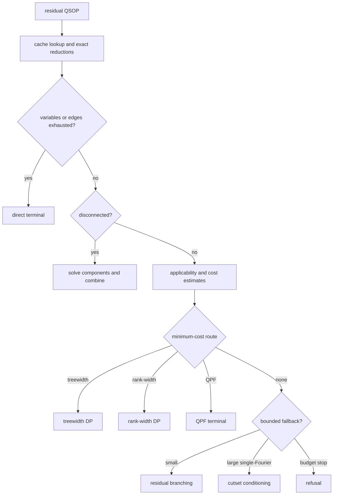

# Solver internals

This guide explains how `sop-solve` chooses a solver. It covers the branch
backend and its treewidth, rank-width, and quadratic phase function (QPF)
delegates. See the [README](../README.md) for the QSOP format and normal CLI
usage.

## Implementation and references

Treewidth orders come from the in-tree
[min-fill implementation](../src/core/min_fill.c). It includes min-degree and
max-degree tie breakers. For the underlying upper-bound heuristics, see
Bodlaender and Koster,
[*Treewidth computations I. Upper bounds*](https://doi.org/10.1016/j.ic.2009.03.008),
*Information and Computation* 208(3), 2010.

Rank decompositions come from the in-tree
[rank-decomposition generators](../src/solve/rankwidth_decomp.c). The
`from-treewidth`, `min-fill-cut`, adjacent-swap, and best-of-candidates builders
are project-specific. They use the cut-rank framework of Oum and Seymour,
[*Approximating clique-width and branch-width*](https://doi.org/10.1016/j.jctb.2005.10.006),
*Journal of Combinatorial Theory, Series B* 96(4), 2006.

The whole-amplitude simplifier implements the path-sum `[HH]` and `[omega]`
rules in [`qsop_simplify.c`](../src/core/qsop_simplify.c). For these rules and
their use before a complete solver, see Huang et al.,
[*Equivalence Checking of Quantum Circuits via Path-Sum and Weighted Model
Counting*](https://doi.org/10.1007/978-3-032-22749-2_21), TACAS 2026, pp.
419--439.

## Dispatch

The branch backend is a dispatcher, not another DP algorithm. It simplifies
the residual QSOP and splits disconnected components. It sends each component
to the cheapest admitted delegate. If none wins, it branches or conditions.


```mermaid
flowchart TD
    A[residual QSOP] --> B[cache lookup and exact reductions]
    B --> C{variables or edges exhausted?}
    C -->|yes| D[direct terminal]
    C -->|no| E{disconnected?}
    E -->|yes| F[solve components and combine]
    E -->|no| G[applicability and cost estimates]
    G --> H{minimum-cost route}
    H -->|treewidth| TW[treewidth DP]
    H -->|rank-width| RW[rank-width DP]
    H -->|QPF| Q[QPF terminal]
    H -->|none| I{bounded fallback?}
    I -->|small| BR[residual branching]
    I -->|large single-Fourier| CS[cutset conditioning]
    I -->|budget stop| X[refusal]
```

The active residual phase is

```text
P(x) = c + sum_v a_v x_v + (r/2) sum_{uv in E} x_u x_v  (mod r).
```

The solver handles two terminal cases directly:

- With no active variables, earlier assignments are part of `c`. The histogram
  has one assignment in bucket `c`. Fourier mode `t` is `omega^(t*c)`.
- With variables but no edges, the variables are independent. The count path
  convolves by `delta_0 + delta_a_v` for each variable. The single-Fourier path
  computes `omega^(t*c) * product_v (1 + omega^(t*a_v))`.

An edge-free residual can still have unary phases and many assignments.

The two result shapes have different resource profiles:

| Path | Result | Residue-axis cost | Component with no delegate |
| --- | --- | --- | --- |
| count-table or all modes | exact count histogram | DP tables carry a factor of `r` | branch within `--max-vars`, otherwise refuse |
| single-Fourier | one coefficient and a certified numeric bound | no `r`-sized table | branch through the fallback limit, then condition within budgets or refuse |

With `--backend branch`, `--solve-mode auto` uses exact counting when practical.
Width and count-vector preflights may choose single-Fourier first. The solver
also retries safe count-path refusals in single-Fourier mode.
`--format residue-vector` always requests the exact count-table path.

For each connected residual, dispatch proceeds as follows:

1. Apply enabled exact reductions and consult the residual cache.
2. Evaluate variable-free and edge-free terminals.
3. Split disconnected support graphs and combine component results.
4. Compute QPF applicability, the treewidth estimate, and an optimistic
   rank-width estimate that includes probe cost.
5. Generate a rank decomposition only if the shared route chooser says the
   optimistic rank-width estimate wins. Call the same chooser again with the
   measured rank-width forecast.
6. Run the selected delegate, or apply the mode-specific bounded fallback.

Count mode skips rank-width probing below 16 active variables. Two root
shortcuts can enter treewidth before residual recursion. They use the same
optimistic rank-width comparison so a plausible rank-width case still enters
the orchestrator.

## Delegation admission

These limits apply to the branch backend. Direct backends have separate
resource controls.

| Delegate | Count-table or all-modes path | Single-Fourier path |
| --- | --- | --- |
| treewidth | min-fill width at most 14, plus a width-18 root fast path through 2500 variables | min-fill width at most 26, DP work at most `4.0e9`, and forecast memory at most 12 GiB |
| rank-width | generated cut-rank at most 12 | generated cut-rank at most 12 |

The single-Fourier CLI fast path sends a root of width 25 or less straight to
treewidth. Width 26 enters the branch path. Treewidth follows the
elimination-order convention, so a width-`w` factor may contain `w + 1`
variables. The memory forecast is `2^w * 128 bytes`. The 128-byte factor is a
calibrated peak estimate that includes live join data. The solver rejects an
over-budget delegate before allocation.

`--max-vars` is an exhaustive-search bound, not a width bound. The CLI defaults
to 24 on the exact count path and raises an unset value to `2^24` for
single-Fourier and auto. Width, work, and memory admission still govern large
low-width components.

## Unified cost model and rank-width joins

### Applicability and route selection

Treewidth and rank-width apply whenever they pass their admission checks. QPF
also needs a compatible result path, a supported phase order, and a
stabilizer-term bound within `--qpf-max-terms` for every requested Fourier
mode. Magic vertices raise this bound; they are not a separate gate. A route
that fails either check gets the estimate `UINT64_MAX` and is ignored.

A shared function chooses the lowest of `tw_est`, `rw_est`, and `qpf_est`.
Treewidth wins an exact tie with QPF. Rank-width must beat the cheapest other
route by `rw_min_speedup`. The solver runs this choice before and after a
rank-decomposition probe.

Define:

- `W_tw` as min-fill `sum 2^(bag size)`, multiplied by `r` on the count path.
- `T_rw`, `J_rw`, and `S_rw` as count-path rank-width table, join-pair, and
  signature forecasts.
- `T_single` as the sum of selected per-join costs for a single-Fourier rank
  decomposition, including its pairwise and twist mix.
- `Q` as the QPF stabilizer-term sum for the requested modes.
- `P_rw = C_rw_probe * nvars^2 * ceil(nvars / 64)` as rank-decomposition probe
  cost.

The estimates are

```text
tw_est = tw_fixed_overhead_ns + C_tw_table * W_tw

qpf_est = qpf_fixed_overhead_ns + C_qpf_term_ns * Q

rw_est_count = rw_fixed_overhead_ns + rw_memory_penalty_ns
             + C_rw_table * T_rw
             + C_rw_join  * J_rw
             + C_rw_sig   * S_rw
             + P_rw

rw_est_single_after_probe = rw_fixed_overhead_ns + T_single

rank-width wins iff rw_est * rw_min_speedup < min(tw_est, qpf_est)
```

Before the probe, the estimate includes `P_rw` and leaves out unknown join
work. It assumes the best feasible cut-rank: zero when the natural-order prefix
cut-rank is zero, and one otherwise. The prefix value is not a lower bound;
another order can compress it. After the probe, the count path uses measured
structure and the single-Fourier path uses the full join profile. The second
comparison omits the probe cost because it has already been paid.

The default policy is:

| Parameter | Default |
| --- | ---: |
| `tw_fixed_overhead_ns` | 10000 |
| `rw_fixed_overhead_ns` | 20000 |
| `C_tw_table` | 4 |
| `C_rw_table` | 80 |
| `C_rw_join` | 40 |
| `C_rw_sig` | 2000 |
| `C_rw_probe` | 2 |
| `C_qpf_term_ns` | 250000 |
| `qpf_fixed_overhead_ns` | 20000 |
| `rw_min_speedup` | 1.1 |
| `rw_memory_penalty_ns` | 0 |

The fixed overheads, speedup threshold, and memory penalty have
`--branch-tw-*` or `--branch-rw-*` flags. The five `C_*` values are private
constants in [`branch.c`](../src/solve/branch.c).

The CLI default `--branch-rw-source auto` derives a rank decomposition from the
treewidth elimination tree. `from-treewidth` selects the same source explicitly,
`native` uses `min-fill-cut`, `both` compares sources where supported, and
`none` disables rank-width probing. The zero-initialized library API defaults
to `none`.

Treewidth preflight uses plain min-fill. The solve builds a
`min-fill-max-degree` order only when needed, then checks width and memory
again. If that order fails but an existing rank decomposition passes,
single-Fourier dispatch can use rank-width instead.

### Quadratic phase function tables

For rank-decomposition node `u`, let `rho_u` be cut-rank, `tau_u` the number of
magic vertices, and `chi_u` the number of retained QPF terms. The hybrid bound is

```text
chi_u <= min(stabilizer_terms(tau_u), chi_left * chi_right, 2^rho_u).
```

A node can rebuild a QPF list from its unary phase, join child lists and their
crossing form, keep the point signature table, or collapse QPF terms back to
points. A QPF record stores a mod-4 linear phase, an upper-triangular quadratic
form, and an affine binary subspace. Count mode uses exact arithmetic in
`Z[zeta_lcm(r,8)][1/2]`. The checked limits are `lcm(r,8) <= 64` and 96
variables.

For `r = 8`, groups of six T-equivalent phases use the verified six-term
decomposition from Eq. (5) of
[Qassim, Pashayan, and Gosset](https://quantum-journal.org/papers/q-2021-12-20-606/).
Other magic vertices use the two-term basis. This gives the bound
`6^(tau/6) * 2^(tau mod 6)`. QPF joins require cubic binary linear algebra in
the boundary dimension, so the term budget is still the main limit.

### Rank-width join kernels

A single-Fourier rank-width join computes

```text
H(w) = sum over P u + Q v = w of F(u) G(v) (-1)^{B(u,v)},
```

where `B` is the crossing parity. The available kernels are:

- `streaming`, which scans child signature pairs without precomputation.
- `materialized`, which builds surviving transitions before batched evaluation.
- `dense`, which bins realized signatures into dense coordinate arrays.
- `twist`, which factors the crossing form through rank `c` and applies
  Walsh-Hadamard transforms over the parent dimension `p` and twist dimension
  `c`.

Twist costs `O(2^(p+c)(p+c) + |U| + |V|)`. A pairwise join costs
`|U| * |V|`. Even Fourier modes have `c = 0`, so twist becomes one XOR
convolution. The implementation caps `p + c` at 22.

`pairwise` chooses among streaming, materialized, and dense. `auto` compares
that choice with twist using the model for `--rankwidth-generate best`. It
builds a twist plan only at 4096 or more forecast pairs, requires a predicted
speedup of at least 10 percent, and caps twist workspace at 512 MiB. An
explicit `twist` request removes this workspace cap. The dimension cap and any
explicit rank-width memory budget still apply.

`--rankwidth-generate best` profiles complete decompositions with the selected
join policy. Progressive search always evaluates left-deep and balanced trees,
then admits more expensive generators while their planning estimate fits a
budget capped at five seconds. `--rankwidth-best-search exhaustive` evaluates
the full generator portfolio.

Pair marking or an exact modular transform finds reachable parent coordinates.
The solver never uses numerical magnitude to test reachability.

## Single-Fourier fallback and conditioning

Odd Fourier modes first apply exact degree-0/1 propagation when the unary
coefficient is `0` or `r/2`. This can cascade, expose a delegate, or prove the
subtree zero. The identity does not apply to even target modes.

When a connected component has no delegate:

- `--branch-single-fourier-fallback delegate-only` refuses immediately.
- A component through `--branch-single-max-fallback-vars`, default 64, uses
  cached residual branching.
- A larger component uses bounded cutset conditioning when
  `--branch-single-cutset-depth` is nonzero.

The CLI uses depth 16 and permits 30 stagnant levels. The zero-initialized
library API leaves conditioning off. At each node, lookahead scores both
children of each candidate. It prefers exact-zero children, then smaller
worst-child components, variable counts, and edge counts. Enabled propagation
and optional materialized `[HH]` reduction run during lookahead. The solver
rechecks delegation as residuals shrink.

The default shortlist ranks Hadamard unlock counts, then degree. An unlock is a
neighbor one pin away from an exact `[HH]` reduction. If there is no unlock
signal, `--branch-shadow auto|on` can use a coefficient-free shadow graph. The
graph removes degree-0/1 vertices and series-reduces degree-2 vertices. It only
ranks real candidates; the solver never sends it to a delegate. The CLI
default is `off`.

Important conditioning defaults are:

| Option | Default |
| --- | ---: |
| `--branch-single-cutset-depth` | 16 |
| `--branch-single-lookahead-candidates` | 8 |
| `--branch-single-max-conditioning-nodes` | 4096 |
| `--branch-single-delegate-reprobe-interval` | 2 |
| `--branch-single-max-stagnant-levels` | 30 |
| `--branch-single-max-search-nodes` | 10000000 |
| `--branch-single-cache-budget-mib` | 256 |
| `--branch-single-cache-min-vars` | 12 |

The solver refuses when a budget runs out.

## Weighted model counting export

`sop2wmc --encoding auto` uses `peel1` preprocessing unless disabled. It chooses
`amp-soft` or `amp-block` from structural coverage and expected output size.
WPCNF is weighted DIMACS CNF. The concrete encodings are:

| Encoding | Contract |
| --- | --- |
| `residue-accumulator` | one DIMACS CNF for each residue, usable with an integer model counter |
| `amp-and` | one WPCNF with hard Tseitin AND constraints and auxiliary complex weights |
| `amp-soft` | one WPCNF with implication auxiliaries weighted by `omega^b - 1` |
| `residue-fourier` | one WPCNF block per Fourier exponent followed by an outer inverse transform |
| `amp-block` | one WPCNF that compresses eligible complete bipartite sign-edge blocks |

Amplitude encodings satisfy

```text
raw_amplitude = weighted_model_count * amplitude_factor
amplitude = raw_amplitude * 2^(-normalization_h / 2).
```

For residue encodings,

```text
raw_amplitude = sum_k counts[k] * exp(2*pi*i*k/r).
```

Metadata comments record the encoding, variable map, normalization, and
reconstruction rule. Run `sop2wmc --help` for preprocessing, Fourier-inner,
and block-threshold options.

## Runtime controls

Run `sop-solve --help-advanced` for the full flag list. The main groups are:

- Backend and mode: `--backend`, `--solve-mode`, `--max-vars`,
  `--treewidth-order`, `--fourier-target-mode`, and `--qpf-max-terms`.
- Cost policy: `--branch-rw-source`, `--branch-rw-min-speedup`, fixed overheads,
  and the rank-width memory penalty.
- Single-Fourier admission: delegate width, DP work, and memory limits.
- Search: fallback, propagation, materialized reduction, conditioning, cache,
  and shadow controls.
- Standalone rank-width policy: memory, join strategy, single-mode kernel,
  best-search policy, and Fourier kernel.
- Observability: `--format stats`, `--trace csv`, and `--stats-jsonl PATH`.

The process reads no solver-tuning environment variables.

## Calibrating the cost model

Branch calibration supports the count-table path:

```sh
build/sop-solve --backend branch --solve-mode count-table \
  --branch-calibrate-backends --stats-jsonl calib.jsonl instance.qsop
```

Calibration ignores the cost comparison but keeps delegate caps. JSONL records
contain forecasts, actual times, probe time, and decomposition-generation time
for both DP backends. For twist calibration, use
`scripts/calibrate_rankwidth_cost.py`. It records join structure, predicted
cost, workspace, and actual time.

## Observing a run

`--format stats` reports delegate counts, skips, widths, table and join work,
QPF activity, and conditioning termination. The main rank-width fields are
`rankwidth_predicted_solve_ns`, `rankwidth_predicted_peak_bytes`, predicted
pairwise and twist join counts, and the `rankwidth_planner_*` counters.
`rankwidth_streaming_join_events`, `rankwidth_materialized_join_events`,
`rankwidth_dense_join_events`, and `rankwidth_twist_join_events` report the
realized kernel mix.

`join_pairs` counts arithmetic charged to the certified error bound. On a twist
join, this means Walsh-Hadamard butterflies and binned rows rather than child
signature pairs.

`--trace csv` writes `phase,depth,items,elapsed_ns` records to stderr. Per-node
`rankwidth.single_join.*` phases report dimensions, predicted time, workspace,
the selected kernel, and actual join time. `--stats-jsonl PATH` adds route and
veto data for each decision. Conditioning child records require
`--branch-single-diagnose-conditioning`.
