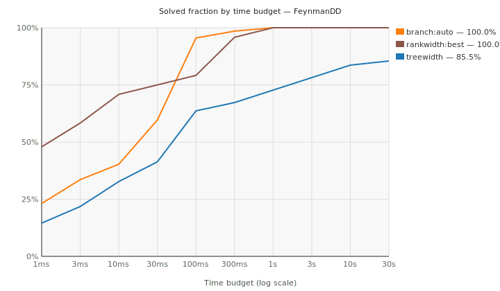
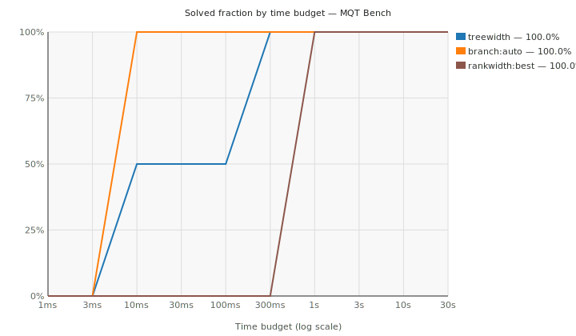
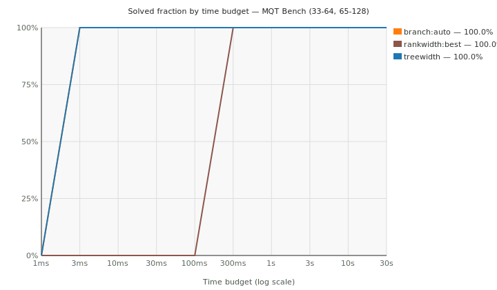
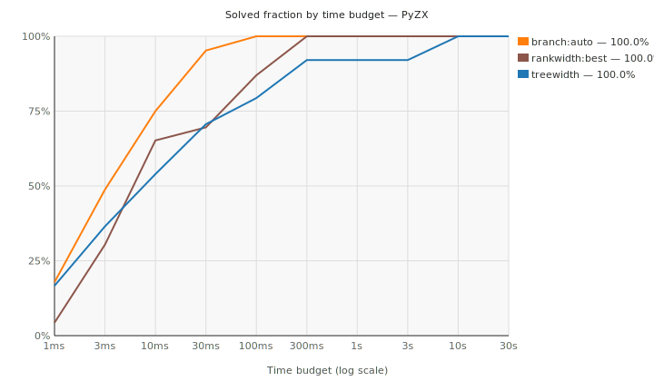
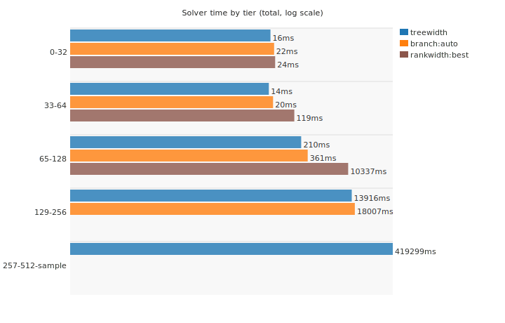
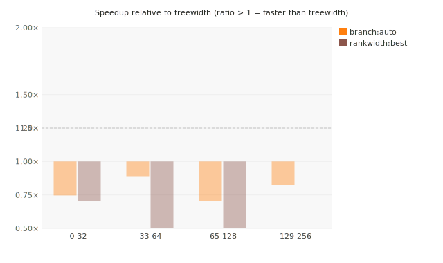
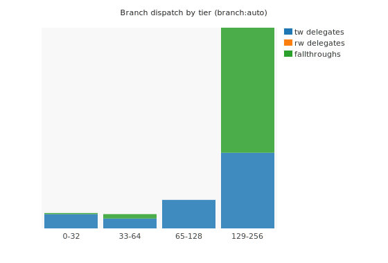

# Scoreboard — labelled QSOPs

Last updated: 2026-06-21. Per-instance timeout: 30 s.

This tracks progress toward a competitive exact strong simulator based on labelled quadratic SOPs. The current benchmark contract is fixed-boundary strong simulation: import a static circuit into QSOP, solve the exact residue-count histogram, and compare with native simulators where possible.

## Benchmarks

Counts are fixed-boundary QSOP rows currently used in solver comparisons. The 257-512 column is an exploratory stratified sample and is shown as solved / attempted when timeouts remain.

| Source | Upstream | Total solved | 0-32 | 33-64 | 65-128 | 129-256 | 257-512 sample |
| --- | --- | ---: | ---: | ---: | ---: | ---: | ---: |
| FeynmanDD | https://github.com/cqs-thu/feynman-decision-diagram | 188 | 24 | 6 | 18 | 86 | 54 / 86 |
| MQT Bench | https://github.com/munich-quantum-toolkit/bench | 4 | 0 | 0 | 2 | 0 | 2 |
| PyZX | https://github.com/zxcalc/pyzx | 126 | 2 | 12 | 32 | 38 | 42 |

Total current solved coverage: **318 fixed-boundary benchmark rows**.
The 257-512 exploratory sample contributes 98 solved rows out of 130 attempted under the current timeout cap.

## Survival Curves

Fraction of instances solved within a given wall-clock budget per backend. Higher and further left is better.

### FeynmanDD

### MQT Bench (small, ≤32 qubits)

Pre-expansion set: circuits with at most 32 qubits, compared against the best native simulator that fits each boundary under its qubit cap.

### MQT Bench (large, 34–128 qubits)

Expanded set: GHZ and BV circuits at 34–128 qubits. The native baseline is `qiskit-clifford` (stabilizer formalism, O(n²) memory) because statevector engines were killed or timed out at 34+ qubits (34-qubit statevector ≈ 272 GB). This plot is regenerated with the rest of the scoreboard when new QSOP and native artifacts are available.

### PyZX

## Solver Time by Tier

Median solve time per tier, log scale. Only `ok` rows counted.

## Speedup vs Treewidth Baseline

Speedup of each backend relative to treewidth on matched pairs. Bars above 1.0x mean the backend is faster.

## Branch Dispatch

Fraction of branch-solver calls dispatched to treewidth sub-solver, rankwidth sub-solver, or pure-branch fallthrough per tier.

## WMC Solve Time Breakdown

Export time vs Ganak time per WMC encoding and tier.

## Internal Solver Configurations

Best configuration per tier at a glance.

| Tier | Configuration | Solved | Total solve time |
| --- | --- | ---: | ---: |
| 0-32 | `treewidth --treewidth-order min-fill-max-degree` | 26 / 26 | 14.1 ms |
| 0-32 | `branch --branch-heuristic split` | 26 / 26 | 16.9 ms |
| 0-32 | `rankwidth --rankwidth-generate left-deep --rankwidth-mode count-table` | 26 / 26 | 23.5 ms |
| 0-32 | `sop2wmc --encoding residue + ganak --mode 0` | 26 / 26 | 34.35 s |
| 33-64 | `treewidth --treewidth-order min-fill-max-degree` | 18 / 18 | 10.7 ms |
| 33-64 | `branch --branch-heuristic split` | 18 / 18 | 11.6 ms |
| 33-64 | `rankwidth --rankwidth-generate min-fill-cut --rankwidth-mode count-table` | 18 / 18 | 46.7 ms |
| 33-64 | `sop2wmc --encoding amp-soft + ganak --mode 6` | 18 / 18 | 1.61 s |
| 33-64 | `sop2wmc --encoding amp-block + ganak --mode 6` | 18 / 18 | 1.61 s |
| 33-64 | `sop2wmc --encoding amplitude + ganak --mode 6` | 18 / 18 | 1.75 s |
| 33-64 | `sop2wmc --encoding residue-fourier + ganak --mode 6` | 18 / 18 | 7.01 s |
| 33-64 | `sop2wmc --encoding residue + ganak --mode 0` | 18 / 18 | 180.93 s |
| 65-128 | `treewidth --treewidth-order min-fill-max-degree` | 52 / 52 | 83.2 ms |
| 65-128 | `branch --branch-heuristic split` | 52 / 52 | 106.8 ms |
| 65-128 | `sop2wmc --encoding amp-block + ganak --mode 6` | 52 / 52 | 9.73 s |
| 65-128 | `sop2wmc --encoding amp-soft + ganak --mode 6` | 52 / 52 | 9.74 s |
| 65-128 | `sop2wmc --encoding amplitude + ganak --mode 6` | 52 / 52 | 10.61 s |
| 129-256 | `treewidth --treewidth-order min-fill-max-degree` | 124 / 124 | 3.96 s |
| 129-256 | `branch --branch-heuristic split` | 124 / 124 | 4.75 s |
| 129-256 | `sop2wmc --encoding amp-soft + ganak --mode 6` | 124 / 124 | 89.73 s |
| 129-256 | `sop2wmc --encoding amp-block + ganak --mode 6` | 124 / 124 | 89.87 s |
| 129-256 | `sop2wmc --encoding amplitude + ganak --mode 6` | 124 / 124 | 97.95 s |
| 257-512 sample | `treewidth --treewidth-order min-fill-max-degree` | 98 / 130 | 1190.64 s |
| 257-512 sample | `sop2wmc --encoding amp-soft + ganak --mode 6` | 90 / 130 | 1755.26 s |
| 257-512 sample | `sop2wmc --encoding amp-block + ganak --mode 6` | 90 / 130 | 1761.97 s |
| 257-512 sample | `sop2wmc --encoding amplitude + ganak --mode 6` | 84 / 130 | 1872.10 s |

## Competitor Comparisons

Best native simulator per source and tier. Speedup = native time / QSOP time, so a value above 1 (**bold**) means QSOP is faster. Native runs only on boundaries it can fit under its qubit cap and finish in time; the **Matched / QSOP-solved** column shows on how many of the solver's rows that holds — a high speedup on a small matched set means QSOP also wins on coverage.

### FeynmanDD

| Tier | QSOP time | Best native | Native time | Best speedup | Matched / QSOP-solved |
| --- | ---: | --- | ---: | ---: | ---: |
| 0-32 | 13.1 ms | `mqt-ddsim-statevector` | 209.4 ms | **15.98x** | 24 / 24 |
| 33-64 | 3.7 ms | `pyzx-matrix` | 8.43 s | **2256.28x** | 6 / 6 |
| 65-128 | 31.6 ms | `pyzx-matrix` | 17.29 s | **547.79x** | 18 / 18 |
| 129-256 | 19.9 ms | `pyzx-matrix` | 17.91 s | **901.81x** | 6 / 86 |

### MQT Bench

| Tier | QSOP time | Best native | Native time | Best speedup | Matched / QSOP-solved |
| --- | ---: | --- | ---: | ---: | ---: |
| 65-128 | 2.9 ms | `pyzx-matrix` | 10.7 ms | **3.71x** | 2 / 2 |

### PyZX

| Tier | QSOP time | Best native | Native time | Best speedup | Matched / QSOP-solved |
| --- | ---: | --- | ---: | ---: | ---: |
| 0-32 | 1.0 ms | `mqt-ddsim-statevector` | 16.2 ms | **16.14x** | 2 / 2 |
| 33-64 | 6.9 ms | `pyzx-matrix` | 117.7 ms | **16.97x** | 12 / 12 |
| 65-128 | 48.8 ms | `pyzx-matrix` | 26.96 s | **552.69x** | 32 / 32 |
| 129-256 | 111.2 ms | `pyzx-matrix` | 35.41 s | **318.31x** | 18 / 38 |

## Current Takeaway

Best current internal configurations by tier: 0-32: `treewidth --treewidth-order min-fill-max-degree`; 33-64: `treewidth --treewidth-order min-fill-max-degree`; 65-128: `treewidth --treewidth-order min-fill-max-degree`; 129-256: `treewidth --treewidth-order min-fill-max-degree`; 257-512 sample: `treewidth --treewidth-order min-fill-max-degree`.
The 257-512 stratified sample is not a full tier yet: 98 / 130 rows solve under the current timeout cap.
Treewidth is the clean direct-DP baseline; hybrid branch is the best widened-tier configuration once component splitting and treewidth handoff trigger. Against native baselines, QSOP is consistently faster than the `pyzx-matrix` tool, while dense `aer-statevector` still wins on some low-width FeynmanDD rows.
