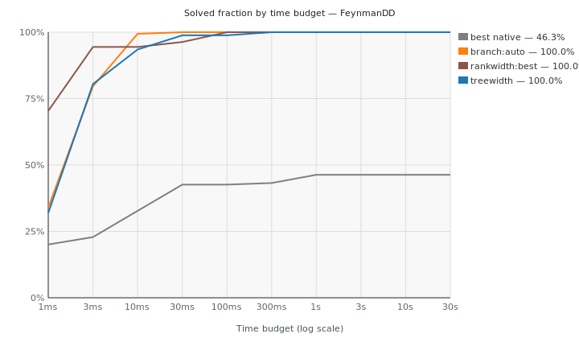
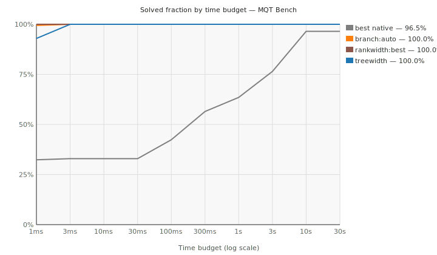
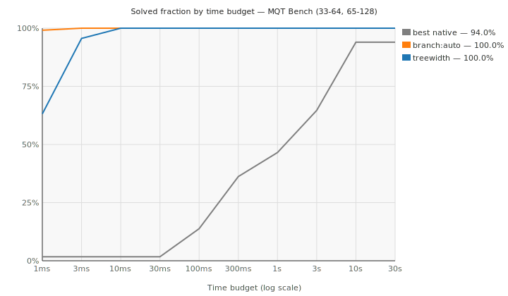
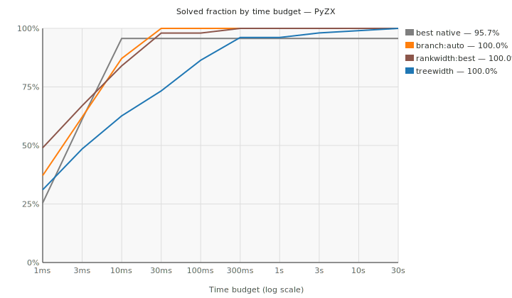
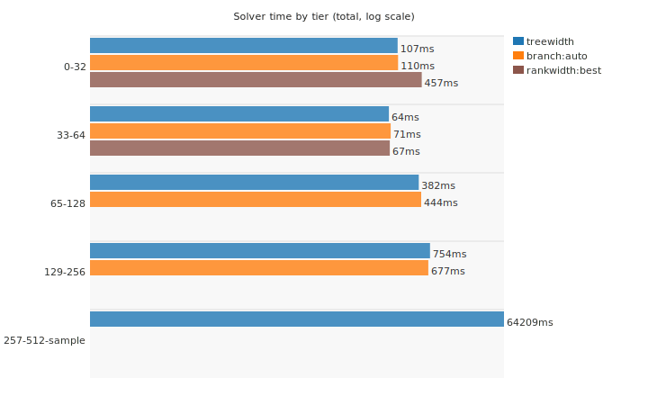
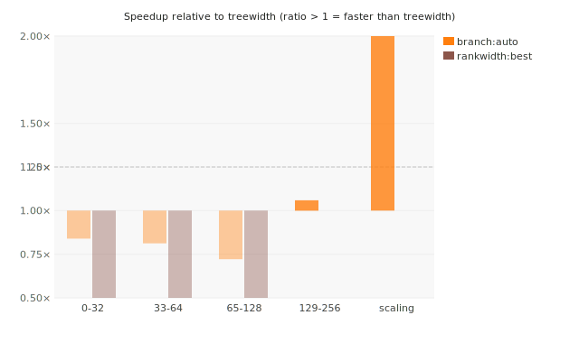
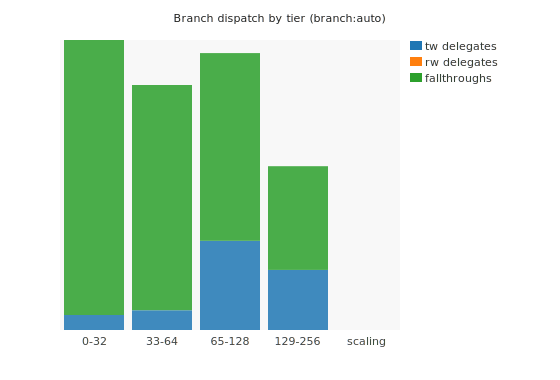
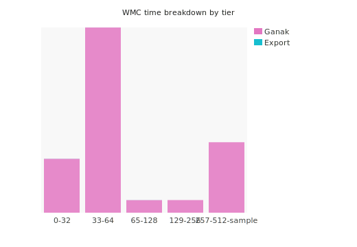

# Scoreboard — sign QSOPs

Last updated: 2026-06-20. Per-instance timeout: 30 s.

This tracks progress toward a competitive exact strong simulator based on labelled quadratic SOPs. The current benchmark contract is fixed-boundary strong simulation: import a static circuit into QSOP, solve the exact residue-count histogram, and compare with native simulators where possible.

## Benchmarks

Counts are fixed-boundary QSOP rows currently used in solver comparisons. The 257-512 column is an exploratory stratified sample and is shown as solved / attempted when timeouts remain.

| Source | Upstream | Total solved | 0-32 | 33-64 | 65-128 | 129-256 | 257-512 sample |
| --- | --- | ---: | ---: | ---: | ---: | ---: | ---: |
| Internal corpus | tests/qasm_solver_corpus.json | 32 | 32 | 0 | 0 | 0 | 0 |
| FeynmanDD | https://github.com/cqs-thu/feynman-decision-diagram | 338 | 80 | 28 | 166 | 50 | 14 |
| MQT Bench | https://github.com/munich-quantum-toolkit/bench | 58 | 56 | 1 | 1 | 0 | 0 |
| PyZX | https://github.com/zxcalc/pyzx | 204 | 44 | 20 | 36 | 48 | 56 / 58 |

Total current solved coverage: **632 fixed-boundary benchmark rows**.
The 257-512 exploratory sample contributes 70 solved rows out of 72 attempted under the current timeout cap.

## Survival Curves

Fraction of instances solved within a given wall-clock budget per backend. Higher and further left is better.

### FeynmanDD

### MQT Bench (small, ≤32 qubits)

Pre-expansion set: circuits with at most 32 qubits. Native simulator runs are only tracked from tier 33-64 upward; this plot shows QSOP solver survival curves only.

### MQT Bench (large, 34–128 qubits)

Expanded set: GHZ and BV circuits at 34–128 qubits. The native baseline is `qiskit-clifford` (stabilizer formalism, O(n²) memory) because statevector engines were killed or timed out at 34+ qubits (34-qubit statevector ≈ 272 GB). This plot is regenerated with the rest of the scoreboard when new QSOP and native artifacts are available.

### PyZX

## Solver Time by Tier

Median solve time per tier, log scale. Only `ok` rows counted.

## Speedup vs Treewidth Baseline

Speedup of each backend relative to treewidth on matched pairs. Bars above 1.0x mean the backend is faster.

## Branch Dispatch

Fraction of branch-solver calls dispatched to treewidth sub-solver, rankwidth sub-solver, or pure-branch fallthrough per tier.

## WMC Solve Time Breakdown

Export time vs Ganak time per WMC encoding and tier.

## Internal Solver Configurations

Best configuration per tier at a glance.

| Tier | Configuration | Solved | Total solve time |
| --- | --- | ---: | ---: |
| 0-32 | `treewidth --treewidth-order min-fill-max-degree` | 212 / 212 | 101.6 ms |
| 0-32 | `branch --branch-heuristic split` | 212 / 212 | 121.1 ms |
| 0-32 | `rankwidth --rankwidth-generate left-deep --rankwidth-mode count-table` | 212 / 212 | 1.05 s |
| 0-32 | `sop2wmc --encoding residue + ganak --mode 0` | 212 / 212 | 532.76 s |
| 33-64 | `branch:auto` | 72 / 72 | 29.4 ms |
| 33-64 | `treewidth --treewidth-order min-fill-max-degree` | 48 / 48 | 41.2 ms |
| 33-64 | `treewidth --treewidth-order min-fill` | 72 / 72 | 42.0 ms |
| 33-64 | `branch --branch-heuristic split` | 48 / 48 | 72.2 ms |
| 33-64 | `rankwidth --rankwidth-generate min-fill-cut --rankwidth-mode count-table` | 48 / 48 | 201.4 ms |
| 33-64 | `sop2wmc --encoding amp-block + ganak --mode 6` | 48 / 48 | 2.79 s |
| 33-64 | `sop2wmc --encoding amp-soft + ganak --mode 6` | 48 / 48 | 2.80 s |
| 33-64 | `sop2wmc --encoding amplitude + ganak --mode 6` | 48 / 48 | 3.84 s |
| 33-64 | `sop2wmc --encoding residue-fourier + ganak --mode 6` | 48 / 48 | 14.28 s |
| 33-64 | `sop2wmc --encoding residue + ganak --mode 0` | 27 / 48 | 1760.46 s |
| 65-128 | `branch:auto` | 0 / 42 | 0 ns |
| 65-128 | `treewidth --treewidth-order min-fill` | 42 / 42 | 87.7 ms |
| 65-128 | `treewidth --treewidth-order min-fill-max-degree` | 202 / 202 | 908.6 ms |
| 65-128 | `branch --branch-heuristic split` | 202 / 202 | 1.36 s |
| 65-128 | `sop2wmc --encoding amp-soft + ganak --mode 6` | 202 / 202 | 39.97 s |
| 65-128 | `sop2wmc --encoding amp-block + ganak --mode 6` | 202 / 202 | 40.76 s |
| 65-128 | `sop2wmc --encoding amplitude + ganak --mode 6` | 202 / 202 | 45.12 s |
| 65-128 | `rankwidth --rankwidth-generate min-fill-cut --rankwidth-mode count-table` | 66 / 202 | 4088.76 s |
| 129-256 | `branch --branch-heuristic split` | 98 / 98 | 2.93 s |
| 129-256 | `treewidth --treewidth-order min-fill-max-degree` | 98 / 98 | 3.10 s |
| 129-256 | `sop2wmc --encoding amp-soft + ganak --mode 6` | 98 / 98 | 39.09 s |
| 129-256 | `sop2wmc --encoding amp-block + ganak --mode 6` | 98 / 98 | 39.91 s |
| 129-256 | `sop2wmc --encoding amplitude + ganak --mode 6` | 98 / 98 | 44.86 s |
| 257-512 sample | `treewidth --treewidth-order min-fill-max-degree` | 70 / 72 | 141.18 s |
| 257-512 sample | `sop2wmc --encoding amp-block + ganak --mode 6` | 68 / 72 | 214.86 s |
| 257-512 sample | `sop2wmc --encoding amp-soft + ganak --mode 6` | 68 / 72 | 221.77 s |
| 257-512 sample | `sop2wmc --encoding amplitude + ganak --mode 6` | 68 / 72 | 222.52 s |

## Competitor Comparisons

Best native simulator per source and tier. Speedup = native time / QSOP time, so a value above 1 (**bold**) means QSOP is faster.

### Internal corpus

| Tier | QSOP time | Best native | Native time | Best speedup |
| --- | ---: | --- | ---: | ---: |
| 0-32 | 6.3 ms | `mqt-ddsim-statevector` | 139.7 ms | **22.18x** |

### FeynmanDD

| Tier | QSOP time | Best native | Native time | Best speedup |
| --- | ---: | --- | ---: | ---: |
| 0-32 | 41.7 ms | `qiskit-statevector` | 766.7 ms | **18.37x** |
| 33-64 | 4.9 ms | `pyzx-matrix` | 20.9 ms | **4.25x** |
| 65-128 | 25.1 ms | `pyzx-matrix` | 15.49 s | **617.94x** |
| 129-256 | 77.1 ms | `aer-statevector` | 15.9 ms | 0.21x |

### MQT Bench

| Tier | QSOP time | Best native | Native time | Best speedup |
| --- | ---: | --- | ---: | ---: |
| 0-32 | 23.2 ms | `pyzx-matrix` | 556.7 ms | **23.98x** |

### PyZX

| Tier | QSOP time | Best native | Native time | Best speedup |
| --- | ---: | --- | ---: | ---: |
| 0-32 | 19.2 ms | `mqt-ddsim-statevector` | 371.1 ms | **19.31x** |
| 33-64 | 16.3 ms | `pyzx-matrix` | 185.9 ms | **11.40x** |
| 65-128 | 137.1 ms | `pyzx-matrix` | 27.29 s | **199.01x** |
| 129-256 | 871.3 ms | `pyzx-matrix` | 43.25 s | **49.64x** |

## Current Takeaway

Best current internal configurations by tier: 0-32: `treewidth --treewidth-order min-fill-max-degree`; 33-64: `treewidth --treewidth-order min-fill-max-degree`; 65-128: `treewidth --treewidth-order min-fill-max-degree`; 129-256: `branch --branch-heuristic split`; 257-512 sample: `treewidth --treewidth-order min-fill-max-degree`.
The 257-512 stratified sample is not a full tier yet: 70 / 72 rows solve under the current timeout cap.
Treewidth is the clean direct-DP baseline; hybrid branch is the best widened-tier configuration once component splitting and treewidth handoff trigger. Against native baselines, QSOP is consistently faster than the `pyzx-matrix` tool, while dense `aer-statevector` still wins on some low-width FeynmanDD rows. Labelled QSOPs have no native baseline: the simulators only evaluate sign boundaries where input equals output.
