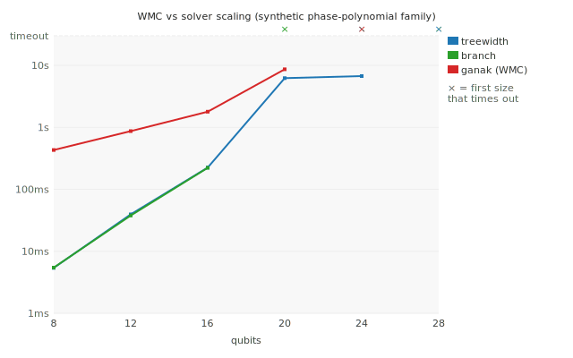

# Scoreboard — sign QSOPs

Last updated: 2026-06-21. Per-instance timeout: 30 s.

This tracks progress toward a competitive exact strong simulator based on labelled quadratic SOPs. The current benchmark contract is fixed-boundary strong simulation: import a static circuit into QSOP, solve the exact residue-count histogram, and compare with native simulators where possible.

## Benchmarks

Counts are fixed-boundary QSOP rows currently used in solver comparisons. The 257-512 column is an exploratory stratified sample and is shown as solved / attempted when timeouts remain.

| Source | Upstream | Total solved | 0-32 | 33-64 | 65-128 | 129-256 | 257-512 sample |
| --- | --- | ---: | ---: | ---: | ---: | ---: | ---: |
| Internal corpus | tests/qasm_solver_corpus.json | 32 | 32 | 0 | 0 | 0 | 0 |
| FeynmanDD | https://github.com/cqs-thu/feynman-decision-diagram | 338 | 80 | 28 | 166 | 50 | 14 |
| MQT Bench | https://github.com/munich-quantum-toolkit/bench | 170 | 56 | 72 | 42 | 0 | 0 |
| PyZX | https://github.com/zxcalc/pyzx | 206 | 44 | 20 | 36 | 48 | 58 |

Total current solved coverage: **746 fixed-boundary benchmark rows**.
The 257-512 exploratory sample contributes 72 solved rows out of 72 attempted under the current timeout cap.

## Survival Curves

Fraction of instances solved within a given wall-clock budget per backend. Higher and further left is better.

### FeynmanDD

### MQT Bench (small, ≤32 qubits)

Pre-expansion set: circuits with at most 32 qubits, compared against the best native simulator that fits each boundary under its qubit cap.

### MQT Bench (large, 34–128 qubits)

Expanded set: GHZ and BV circuits at 34–128 qubits. The native baseline is `qiskit-clifford` (stabilizer formalism, O(n²) memory) because statevector engines were killed or timed out at 34+ qubits (34-qubit statevector ≈ 272 GB). This plot is regenerated with the rest of the scoreboard when new QSOP and native artifacts are available.

### PyZX

## Solver Time by Tier

Median solve time per tier, log scale. Only `ok` rows counted.

## Speedup vs Treewidth Baseline

Speedup of each backend relative to treewidth on matched pairs. Bars above 1.0x mean the backend is faster.

## Branch Dispatch

Fraction of branch-solver calls dispatched to treewidth sub-solver, rankwidth sub-solver, or pure-branch fallthrough per tier.

## WMC Solve Time Breakdown

Export time vs Ganak time per WMC encoding and tier.

## WMC vs Solver Scaling

Synthetic phase-polynomial circuits (committed under `benchmarks/corpus/sop/synthetic/scaling/`) whose QSOP treewidth grows with the qubit count. Real benchmark families cannot show this: the scalable MQT families use continuous-angle gates the finite-modulus importer rejects, and the importable ones are Clifford with trivial treewidth. As treewidth grows the branch backend collapses first. Across the sizes both solve, the treewidth DP stays ahead of ganak (WMC) — the DP's lead narrows as treewidth grows, so any crossover lies past the point where ganak itself stays tractable. Largest size solved under the current cap: branch 16q, treewidth 24q, ganak 20q.

## Internal Solver Configurations

Best configuration per tier at a glance.

| Tier | Configuration | Solved | Total solve time |
| --- | --- | ---: | ---: |
| 0-32 | `treewidth --treewidth-order min-fill-max-degree` | 212 / 212 | 107.3 ms |
| 0-32 | `branch --branch-heuristic split` | 212 / 212 | 110.5 ms |
| 0-32 | `rankwidth --rankwidth-generate left-deep --rankwidth-mode count-table` | 212 / 212 | 456.6 ms |
| 0-32 | `sop2wmc --encoding residue + ganak --mode 0` | 212 / 212 | 492.42 s |
| 33-64 | `treewidth --treewidth-order min-fill-max-degree` | 48 / 48 | 29.1 ms |
| 33-64 | `branch:auto` | 72 / 72 | 29.4 ms |
| 33-64 | `treewidth --treewidth-order min-fill` | 72 / 72 | 34.5 ms |
| 33-64 | `branch --branch-heuristic split` | 48 / 48 | 41.3 ms |
| 33-64 | `rankwidth --rankwidth-generate min-fill-cut --rankwidth-mode count-table` | 48 / 48 | 67.1 ms |
| 33-64 | `sop2wmc --encoding amp-soft + ganak --mode 6` | 48 / 48 | 2.53 s |
| 33-64 | `sop2wmc --encoding amp-block + ganak --mode 6` | 48 / 48 | 2.59 s |
| 33-64 | `sop2wmc --encoding amplitude + ganak --mode 6` | 48 / 48 | 3.54 s |
| 33-64 | `sop2wmc --encoding residue-fourier + ganak --mode 6` | 48 / 48 | 13.79 s |
| 33-64 | `sop2wmc --encoding residue + ganak --mode 0` | 27 / 48 | 1673.73 s |
| 65-128 | `branch:auto` | 42 / 42 | 20.2 ms |
| 65-128 | `treewidth --treewidth-order min-fill` | 42 / 42 | 35.6 ms |
| 65-128 | `treewidth --treewidth-order min-fill-max-degree` | 202 / 202 | 346.6 ms |
| 65-128 | `branch --branch-heuristic split` | 202 / 202 | 423.4 ms |
| 65-128 | `sop2wmc --encoding amp-block + ganak --mode 6` | 202 / 202 | 37.06 s |
| 65-128 | `sop2wmc --encoding amp-soft + ganak --mode 6` | 202 / 202 | 37.17 s |
| 65-128 | `sop2wmc --encoding amplitude + ganak --mode 6` | 202 / 202 | 41.38 s |
| 129-256 | `branch --branch-heuristic split` | 98 / 98 | 677.0 ms |
| 129-256 | `treewidth --treewidth-order min-fill-max-degree` | 98 / 98 | 753.7 ms |
| 129-256 | `sop2wmc --encoding amp-soft + ganak --mode 6` | 98 / 98 | 36.89 s |
| 129-256 | `sop2wmc --encoding amp-block + ganak --mode 6` | 98 / 98 | 37.05 s |
| 129-256 | `sop2wmc --encoding amplitude + ganak --mode 6` | 98 / 98 | 41.81 s |
| 257-512 sample | `treewidth --treewidth-order min-fill-max-degree` | 72 / 72 | 64.21 s |
| 257-512 sample | `sop2wmc --encoding amp-soft + ganak --mode 6` | 68 / 72 | 215.45 s |
| 257-512 sample | `sop2wmc --encoding amplitude + ganak --mode 6` | 68 / 72 | 215.71 s |
| 257-512 sample | `sop2wmc --encoding amp-block + ganak --mode 6` | 68 / 72 | 215.95 s |

## Competitor Comparisons

Best native simulator per source and tier. Speedup = native time / QSOP time, so a value above 1 (**bold**) means QSOP is faster. Native runs only on boundaries it can fit under its qubit cap and finish in time; the **Matched / QSOP-solved** column shows on how many of the solver's rows that holds — a high speedup on a small matched set means QSOP also wins on coverage.

### Internal corpus

| Tier | QSOP time | Best native | Native time | Best speedup | Matched / QSOP-solved |
| --- | ---: | --- | ---: | ---: | ---: |
| 0-32 | 14.6 ms | `mqt-ddsim-statevector` | 297.1 ms | **20.42x** | 32 / 32 |

### FeynmanDD

| Tier | QSOP time | Best native | Native time | Best speedup | Matched / QSOP-solved |
| --- | ---: | --- | ---: | ---: | ---: |
| 0-32 | 43.4 ms | `mqt-ddsim-statevector` | 718.3 ms | **16.56x** | 80 / 80 |
| 33-64 | 2.6 ms | `pyzx-matrix` | 22.0 ms | **8.55x** | 4 / 28 |
| 65-128 | 6.8 ms | `pyzx-matrix` | 8.67 s | **1276.13x** | 3 / 166 |
| 129-256 | 20.3 ms | `qiskit-clifford` | 518.9 ms | **25.51x** | 2 / 50 |

### MQT Bench

| Tier | QSOP time | Best native | Native time | Best speedup | Matched / QSOP-solved |
| --- | ---: | --- | ---: | ---: | ---: |
| 0-32 | 22.4 ms | `pyzx-matrix` | 607.2 ms | **27.15x** | 56 / 56 |
| 33-64 | 29.4 ms | `qiskit-clifford` | 48.35 s | **1646.70x** | 72 / 72 |
| 65-128 | 17.5 ms | `qiskit-clifford` | 212.84 s | **12185.24x** | 36 / 42 |

### PyZX

| Tier | QSOP time | Best native | Native time | Best speedup | Matched / QSOP-solved |
| --- | ---: | --- | ---: | ---: | ---: |
| 0-32 | 19.8 ms | `mqt-ddsim-statevector` | 345.1 ms | **17.44x** | 44 / 44 |
| 33-64 | 11.2 ms | `pyzx-matrix` | 185.6 ms | **16.61x** | 20 / 20 |
| 65-128 | 50.7 ms | `pyzx-matrix` | 28.74 s | **566.80x** | 34 / 36 |
| 129-256 | 151.9 ms | `pyzx-matrix` | 4.12 s | **27.13x** | 18 / 48 |

## Current Takeaway

Best current internal configurations by tier: 0-32: `treewidth --treewidth-order min-fill-max-degree`; 33-64: `treewidth --treewidth-order min-fill-max-degree`; 65-128: `treewidth --treewidth-order min-fill-max-degree`; 129-256: `branch --branch-heuristic split`; 257-512 sample: `treewidth --treewidth-order min-fill-max-degree`.
The 257-512 column is an exploratory stratified sample (72 rows), not the full tier; all solve under the current timeout cap.
Treewidth is the clean direct-DP baseline; hybrid branch is the best widened-tier configuration once component splitting and treewidth handoff trigger. Against native baselines, QSOP is consistently faster than the `pyzx-matrix` tool, while dense `aer-statevector` still wins on some low-width FeynmanDD rows.
